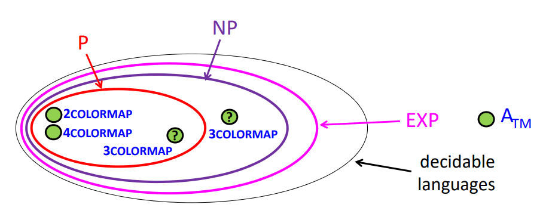

Do all problems have efficient algorithms?

## Elephant Jokes

- How do you shoot a blue elephant?
	- With a blue elephant gun.
- How do you shoot a red elephant?
	- Hold its trunk shut until it turns blue, then shoot it with a blue elephant gun.
- How do you shoot a purple elephant?
	- Paint it red, hold its trunk shut until it turns blue, then shoot it with a blue elephant gun.

## Reductions

Say we have two problems:
- Problem 1: Shoot a red elephant.
- Problem 2: Shoot a blue elephant.

We can say that $P_1$ **reduces to** $P_2$ if we can design an algorithm for solving $P_1$ that uses $P_2$.
- $P_1 \leq_T P_2$
- $P_1$ reduces to $P_2$
- $P_1$ can be solved in terms of $P_2$
- $P_1$ can be solved using $P_2$ as a subroutine
- IMPORTANT: Note the order! This is easy to flip-flop!

Given our original problems: this means that the problem of shooting a red elephant can be solved by shooting a blue elephant.

What else does this tell us?
- If $P_2$ is easy, then $P_1$ is easy
- If $P_1$ is hard, then $P_2$ is hard (we'll use this idea a lot)
- $P_1$ is **no harder than** $P_2$
- $P_2$ is **at least as hard as** $P_1$

We can similarly talk about languages this way. $L_1 \leq_T L_2$ means:
- deciding $L_1$ is **no harder than** deciding $L_2$, or
- deciding $L_2$ is **at least as hard as** deciding $L_1$.

### Example: Showing the Halting problem to be undecidable

Last time: $A_{TM}$ is undecidable.
- $A_{TM} = \\{\<M,w\> : M \text{ accepts w}\\}$
- $HALT_{TM} = \\{\<M,w\> : M \text{ halts on input w}\\}$

Recall: $HALT_{TM}$ is recognizable
- You can create a Turing machine $U$ that takes an $\<M,w\>$ and simulate it: if $U$ halts, our original Turing machine $M$ accepts

We want to show that $A_{TM} \leq_T HALT_{TM}$. Proof by contradiction:
- Suppose there is a Turing machine $R$ that decides $HALT_{TM}$ (it doesn't exist).
- We want to use $R$ to design a Turing machine $S$ that decides $A_{TM}$. Design:
	- Use $R$ to reject if the input runs forever
	- Otherwise, simply simulate the input (it is now guaranteed to be decidable)
- So we can, and we do, and we arrive at a contradiction: as we know there is no such decider for $A_{TM}$.

Then as $A_{TM}$ reduces to $HALT_{TM}$: $HALT_{TM}$ is at least as hard as $A_{TM}$, which is undecidable. So $HALT_{TM}$ is undecidable.

Aside: reduction can go both ways! $A_{TM}$ reduces to $HALT_{TM}$, and vice versa. There are (probably) problems that cannot be related, however.

## Computability vs Complexity

What is the difference between this theory of computation and Turing machines, vs. complexity?

Computability theory studies whether problems have **any** algorithmic solution whatsoever. 

Complexity theory studies whether problems have **efficient** algorithmic solutions.
- How much time is required?
- How much space is required?
- Does randomness help?

### Worst case analysis

Usually theorists do "worst case analysis", i.e. as a function of the input length $n$, what is the maximum amount of resources used over all inputs of length $n$? (note: $n$ is a commonly used variable!)

The idea here is that it's helpful to analyze the worst case, as every input will then result in equal or better time.

Definition: The **runtime** of a Turing machine $M$ is $f : \mathbb{N} \to \mathbb{N}$: $f(n) = max(x \in \Sigma\*, |x|=n)$. (the number of steps of $M$ on input $x$ until it halts) (assume $M$ is a decider for simplicity)

Definition: a **class** is a set of languages (or computational problems)

Definition: a **complexity class** is a class defined by Turing machine resource constraints.

Definition: **TIME(t(n))** is the class of all languages $L$ such that there exists a Turing machine with runtime $O(t(n))$ that decides $L$.

Recall: different machine models have different efficiencies: our multi-tape Turing machines were broadly more efficient than our single-tape Turing machines. For example: 
- $PAL = \\{ww^R : w \in \Sigma\*\\}$
- Decided by a single-tape Turing machine in $O(n^2)$ time
- Decided by a multi-tape Turing machine in $O(n)$ time

## Revisiting the Church-Turing thesis

The **Extended Church-Turing thesis** is the belief that Turing machines capture our intuitive notation of what is **efficiently computable**.
- Everything we can compute in time $t(n)$ on any physical computer can be computed on a Turing machine in time $O(t(n)^c)$, for some constant $c$.

Is this true, does it hold? Maybe not, with new forms of computation like quantum computers.

## P and EXP

Definition: $P = \large \cup_{c>0} TIME(n^c)$

Why is P a good definition for efficient computation?
- Insensitive to model of computation: by the extended Church-Turing thesis, switching computational models "only" involves a polynomial slowdown
- Closed under composition: can use polynomial time algorithm as a subroutine
- In practice: **algorithms usually can be improved**. If we find an $O(n^{30})$ time algorithm, it typically can be improved to, say, $O(n^5)$ time.

### Example: Two color map

Let $G$ be a "map" of countries in the plane, where a coloring is valid if neighboring countries have different colors.

The two color map _does not_ work for every map. So consider it as a problem: $2COLORMAP = \\{\<G\>: G \text{ has valid red/blue coloring}\\}$. Is $2COLORMAP \in P$?

Sure: start with an arbitrary country, set it to red, set their neighbors to blue, and continue. If there is a conflict, reject, if there is no conflict, accept.

It's unknown if the three color map is in P. It's known to be in EXP: $O(3^n n^2) \in O(4^n)$

Definition: $EXP = \large \cup_{k>0} TIME(2^{n^k})$

The four color map works for all maps, so $4COLORMAP = \\{\<G\> : G \text{ is a valid map}\\}$.

## Time Hierarchy Theorem

Question: is $EXP = P$? Answer: No!

Definition: the **time hierarchy theorem** tells us that given an $f : \mathbb{N} \to \mathbb{N}$ that is "reasonable" where $f(n) = \Omega(n \log n)$, then the $TIME(f(n)) \subset TIME(f(n)^4)$.
- Notably: $TIME(f(n)) \neq TIME(f(n)^4)$!
- Corollary: $TIME(n^c) \neq TIME(n^{4c})$ for any $c \geq 1$.
- Corollary: $TIME(n^c) \neq TIME(2^n)$ for any $c \geq 1$.
- $TIME(2^{n^k}) \neq TIME$

How do you prove the time hierarchy theorem?
- By diagonalization: look at Turing machines that are "fast" and that are "slow"
- Idea: look at all Turing machines that run in "fast" time: and come up with a language that they cannot possibly decide
- But we want that language to be decidable by a "slow" Turing machine.

Language that is in EXP and not in P: ???

todo: rework this entire section, it doesn't make sense

## Time Complexity

Where is 3COLORMAP? We know it is in EXP, and either in NP or in both NP and P.

The Time Hierarchy theorem tells us that there is something in $EXP \setminus P$. [why? still not clear]

## NP and Time Complexity

NP is very important! Contains a large amount of natural problems
- Ex. Hamilton path, 3 color graph, graph isomorphism, satisfiable boolean formulas
- Many problems in NP have "identical complexity", i.e. are complete (we'll talk about this later)

Definition: the **runtime** of NTM on input X is the max-length of any root-leaf path 
- For deciders - no infinite paths!

Recall: $TIME(t(n)) = \\{\text{language L} : \exists \text{ TM M that decides L in time O(t(n))}\\}$
- $P = \cup_{c>0} TIME(n^c)$

Definition: $NTIME(t(n)) = \\{\text{language L} : \exists \text{ NTM M that decides L in time O(t(n))}\\}$
- $NP = \cup_{c>0} NTIME(n^c)$

Obvious: $P \sube NP$.

<!-- aside: "P is a 'larger class' than NP": but not strictly larger? god, i love unintuitive definitions -->

### Example: 3COLORMAP

Let's prove that $3COLORMAP \in NP$.

Proof: Design a nondeterministic Turing machine to decide 3COLORMAP in polynomial time.
- Iterate through vertices
- Nondetermistically pick a color for each vertex (a "lucky guess")
- Check all pairs of neighbors to see if they are the same color
- If so reject, else accept

### NP and EXP

Claim: $NP \sube EXP$.
Idea: For any $L \in NP$, there is an NTM deciding $L$ in polynomial time. We can simulate it with a DTM that does the breadth-first search on the configuration tree. The tree has a number of nodes _exponential_ in runtime of the NTM.

There are several open questions surrounding P, NP, and EXP:
1. Is $P \neq NP$, i.e. $P \subset NP$? 
2. Is $NP \neq EXP$, i.e. $NP \subset EXP$?

The answer to **either Q1 or Q2** is yes. Proof: $P \sube NP \sube EXP$, yet by the time hierarchy theorem $P \neq EXP$. So either $P \neq NP$ or $NP \neq EXP$ (or both).

Theorem: The following are equivalent:
- There exists a nondeterministic, polytime TM M that decides L.
- There exists a deterministic, polytime TM V and a constant c s.t.
	- $L = \\{x \in \Sigma\* : \exists y \in \Sigma\* \text{ s.t. } \|y\| \leq \|x\|^c \land V \text{ accepts } (x,y)\\}$
- x: "input", y: "certificate", V: "verifier"
- i.e. for the three color graph, give us a colored graph and we can verify it

Claim: $3COLOR \in NP$.
- $\\{\<G\> : \text{ G is 3-colorable}\\}$
- Must find a deterministic polytime TM V s.t. $3COLOR = \\{x: \exists y, \|y\| \leq \|x\|^c, V \text{ accepts } (x,y)\\}$
- Code for $V$: on input (x,y)
- If $x$ not of form $\<G\>$, where $G=(V,E)$ is a graph, reject
- From $y$, extract values $color[v] \in \\{1,2,3\\}$ for each $v \in V$
- For every edge $\\{u,v\\} \in E$: If $color[u] = color[v]$, reject
- Otherwise accept
- $y$ does exist, it's simply a valid coloring of the graph

To show correctness of V, we need three things:

1: If $x = \<G\>$ and G is 3-colorable: need $\exists y \text{ s.t. } \|y\| \leq \|x\|^c$ and $\text{V accepts (x,y)}$. It does exist, y can be a valid 3 coloring of G. Note: $\|y\| = O(n)$ and $\|x\| = \Omega(n)$

2: If $x \neq \<G\>$ where G is 3-colorable: then no certificate y should make V erroreously accept.
- If x not of form $\<G\>$: v definitely rejects.
- If x of form $\<G\>$ by not 3-colorable, then V must reject becasuse it always checks that y is a valid coloring.

3: Must check that V runs in time polynomial in |xy|.
- Decoding takes polytime, checking neighbors takes polytime.

